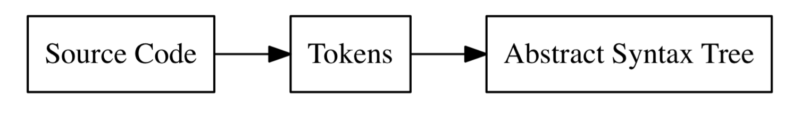

# Lexing

## 1.1 Lexical Analysis

The lexical analysis or lexing is the process that converts our source code into more easy to use structures called tokens that further wil be use to build an Abstract Syntax Tree (AST)



This Job is performed by I lexer (also called tokenizer or scanner). Tokens are small and easy to categorize data structures thar then are passed to the parser that builds the AST

### Example

This is an input that we could give to the lexer:

`let x = 5 + 5;`

And the output would or tokenized version would look like this:

```
[
    LET,
    IDENTIFIER("x"),
    EQUAL_SIGN,
    INTEGER(5),
    PLUS_SIGN,
    INTEGER(5),
    SEMICOLON
]
```

## 1.5 Start of a REPL

REPL stands for "Read Eval Print Loop". Sometimes the REPL is called "console" or "interactive mode", however it refers to the same thing. The REPL reads input, sends it to the interpreter for evaluation, prints the result/output, and starts again.
